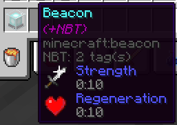

# Inspecio
<!-- modrinth_exclude.start -->
 <!-- modrinth_exclude.end -->
[](https://raw.githubusercontent.com/Queerbric/Inspecio/1.18/LICENSE)

[![Mod loader: Quilt]][quilt] <!-- modrinth_exclude.start -->
 <!-- modrinth_exclude.end -->

Better and more tooltips on items!

## What's this mod?

Inspecio adds new tooltips to items like shulker boxes, filled map, fish bucket, armor, food, banner patterns, etc.

Some of those are just replacement to the vanilla "text" tooltip with a more fancy one, others are extra information for the user!

Most of the mod is configurable, some parts can be enabled/disabled to your heart's desire!

## Pictures

#### Armor tooltip


#### Food tooltip


#### Effects tooltips




#### Shulker Box tooltips (and other storage blocks)

Normal:


Colored:


Compact:


#### Jukebox tooltip


#### Loot Table Tooltip


#### Bee Hive Tooltip


#### Sign Tooltip


#### Banner Pattern


#### Campfire


#### Filled Map


#### Entities

##### Armor Stand


##### Bucket of Fish


##### Bucket of Axolotl


##### Spawn Eggs


#### Lodestone Compass


#### Repair Cost


## Configuration

The configuration file of the mod is located in `<minecraft directory>/config/inspecio.json`.

You can use the command `/inspecio config` to manage configuration.

Here's the default configuration:

```json
{
  "jukebox": "fancy",
  "sign": "fancy",
  "advanced_tooltips": {
    "repair_cost": true,
    "lodestone_coords": false
  },
  "filled_map": {
    "enabled": true,
    "show_player_icon": false
  },
  "food": {
    "hunger": true,
    "saturation": "merged"
  },
  "containers": {
    "campfire": true,
    "storage": {
      "enabled": true,
      "compact": false,
      "loot_table": true
    },
    "shulker_box": {
      "enabled": true,
      "compact": false,
      "loot_table": true,
      "color": true
    }
  },
  "effects": {
    "food": true,
    "hidden_motion": true,
    "hidden_effect_mode": "enchantment",
    "beacon": true,
    "potions": true,
    "tipped_arrows": true,
    "spectral_arrow": true
  },
  "entities": {
    "fish_bucket": {
      "enabled": true,
      "always_show_name": false,
      "spin": true
    },
    "spawn_egg": {
      "enabled": true,
      "always_show_name": false,
      "spin": true
    },
    "pufferfish_puff_state": 2,
    "armor_stand": {
      "enabled": true,
      "always_show_name": false,
      "spin": true
    },
    "bee": {
      "enabled": true,
      "always_show_name": false,
      "spin": true,
      "show_honey_level": true
    },
    "mob_spawner": {
      "enabled": true,
      "always_show_name": false,
      "spin": true
    }
  },
  "armor": true,
  "banner_pattern": true
}
```

Here's a list of each configuration entries and what they do:

 - `armor` (`bool`) - `true` if the display of the armor bar on armor items is enabled, or `false` otherwise.
 - `banner_pattern` (`bool`) - `true` if the display of the pattern in the tooltip of banner patterns is enabled, or `false` otherwise.
 - `advanced_tooltips`
   - `repair_cost` (`bool`) - `true` if the display the repair cost value is enabled, or `false` otherwise.
   - `lodestone_coords` (`bool`) - `true` if a display of the lodestone coordinates on lodestone compass is enabled, or `false` otherwise.
 - `containers`
   - `campfire` (`bool`) - `true` if the display of a special tooltip on campfires which hold custom NBT is enabled, or `false` otherwise.
   - `storage`
     - `enabled` (`bool`) - `true` if the inventory of storage items like chests, barrels, etc. should be shown in the tooltip, or `false` otherwise.
     - `compact` (`bool`) - `true` if the inventory should be compacted to take as little space as possible, or `false` otherwise.
     - `loot_table` (`bool`) - `true` if the loot table identifier should be displayed in the tooltip if specified, or `false` otherwise.
   - `shulker_box`
     - `enabled` (`bool`) - `true` if the inventory of shulker boxes should be shown in the tooltip, or `false` otherwise.
     - `compact` (`bool`) - `true` if the inventory should be compacted to take as little space as possible, or `false` otherwise.
     - `loot_table` (`bool`) - `true` if the loot table identifier should be displayed in the tooltip if specified, or `false` otherwise.
     - `color` (`bool`) - `true` if the inventory tooltip should be colored the same as the shulker box, or `false` otherwise.
 - `effects`
   - `potions` (`bool`) - `true` if replacing the effect tooltips with a fancy one on potion items is enabled, or `false` otherwise.
   - `tipped_arrows` (`bool`) - `true` if replacing the effect tooltips with a fancy one on tipped arrows is enabled, or `false` otherwise.
   - `spectral_arrow` (`bool`) - `true` if replacing the effect tooltips with a fancy one on spectral arrow item is enabled, or `false` otherwise.
   - `food` (`bool`) - `true` if adding effect tooltips on food items is enabled, or `false` otherwise.
   - `hidden_motion` (`bool`) - `true` if using obfuscated text for hidden effect tooltips is enabled, or `false` otherwise.
   - `hidden_effect_mode` (`string`) - `"enchantment"` will display the obfuscated text for hidden effect tooltips with the enchantment font, `"obfuscated"` will use the normal font.
   - `beacon` (`bool`) - `true` if adding a tooltip with the primary and secondary effects (if they exist) is enabled, or `false` otherwise.
 - `entities`
   - `armor_stand`
      - `enabled` (`bool`) - `true` if armor stand tooltip should be displayed, or `false` otherwise.
      - `always_show_name` (`bool`) - `true` if the name of an armor stand should always be shown, or `false` otherwise and use the CTRL key instead.
      - `spin` (`bool`) - `true` if the armor stand spin in the tooltip, or `false` otherwise
   - `bee`
     - `enabled` (`bool`) - `true` if displaying the bees in the beehive tooltip is enabled, or `false` otherwise.
     - `always_show_name` (`bool`) - `true` if the name of the bees should always be shown, or `false` otherwise and use the CTRL key instead.
     - `spin` (`bool`) - `true` if the bees spin in the tooltip, or `false` otherwise.
     - `show_honey_level` (`bool`) `true` if the honey level should be shown, or `false` otherwise.
   - `fish_bucket`
     - `enabled` (`bool`) - `true` if fish bucket tooltips should display the entity they hold, or `false` otherwise.
     - `spin` (`bool`) - `true` if the entity spins in the tooltip, or `false` otherwise.
   - `mob_spawner`
     - `enabled` (`bool`) - `true` if mob spawner tooltips should display the entity they hold, or `false` otherwise.
     - `always_show_name` (`bool`) - `true` if the name of the hold entity should always be shown, or `false` otherwise.
     - `spin` (`bool`) - `true` if the entity spins in the tooltip, or `false` otherwise.
   - `spawn_egg`
     - `enabled` (`bool`) - `true` if spawn egg tooltips should display the entity they hold, or `false` otherwise.
     - `always_show_name` (`bool`) - `true` if the name of the hold entity should always be shown, or `false` otherwise.
     - `spin` (`bool`) - `true` if the entity spins in the tooltip, or `false` otherwise.
   - `pufferfish_puff_state` (`int`) - the pufferfish puff state, between 0 and 2 inclusive.
 - `filled_map`
   - `enabled` (`bool`) - `true` if filled map tooltips should display the map, or `false` otherwise.
   - `show_player_icon` (`bool`) - `true` if show the player icon on filled map tooltips, or `false` otherwise.
 - `food`
   - `hunger` (`bool`) - `true` if hunger bar should be displayed on food items, or `false` otherwise.
   - `saturation` (`string`) - `"disabled"` does nothing, `"merged"` adds the saturation bar as an outline to the hunger bar, `"separated"` adds its own saturation bar.
 - `jukebox` (`string`) - `"disabled"` does nothing, `"fast"` will add the inserted disc name if possible in the tooltip of jukeboxes, `"fancy"` will display the disc item as well.
 - `sign` (`string`) - `"disabled"` does nothing, `"fast"` will add the sign content as text tooltip if possible, `"fancy"` will add a fancy sign tooltip if possible.

[quilt]: https://quiltmc.org
[Mod loader: Quilt]: https://img.shields.io/badge/modloader-Quilt-9115ff?style=flat-square
